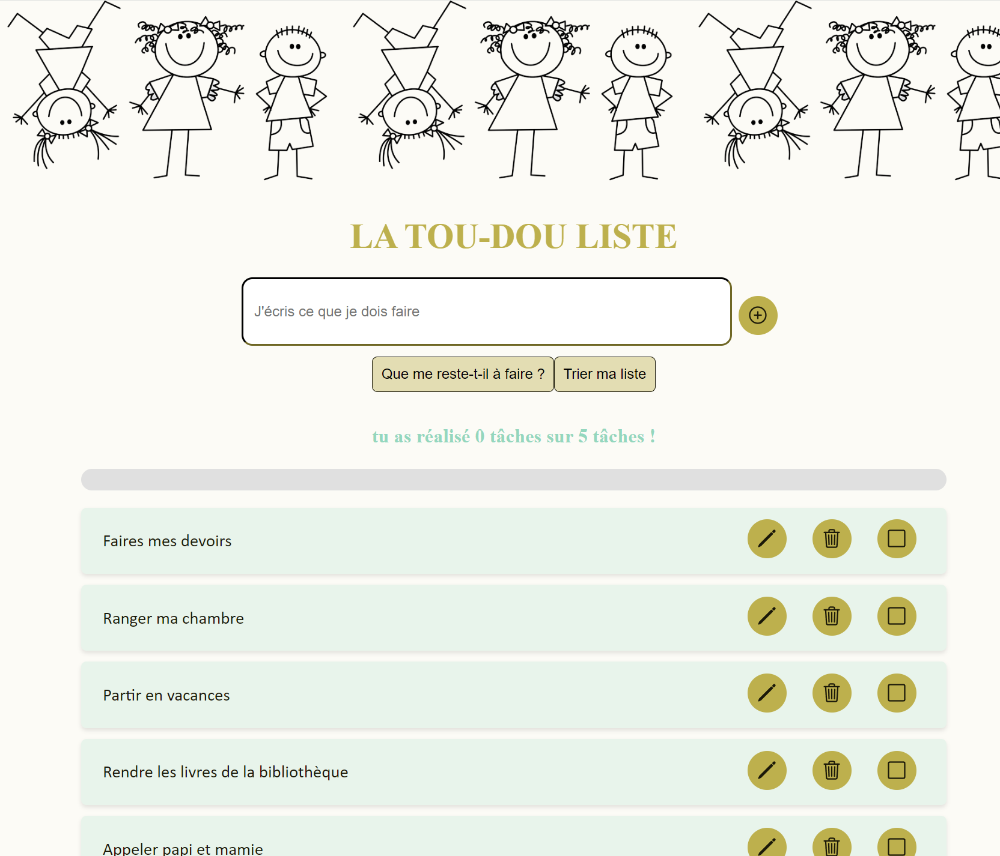
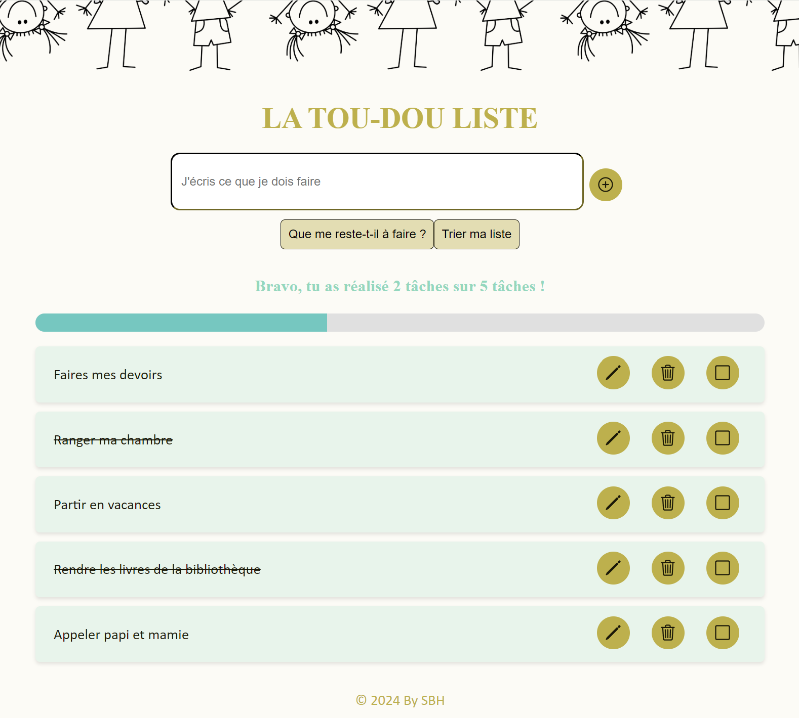
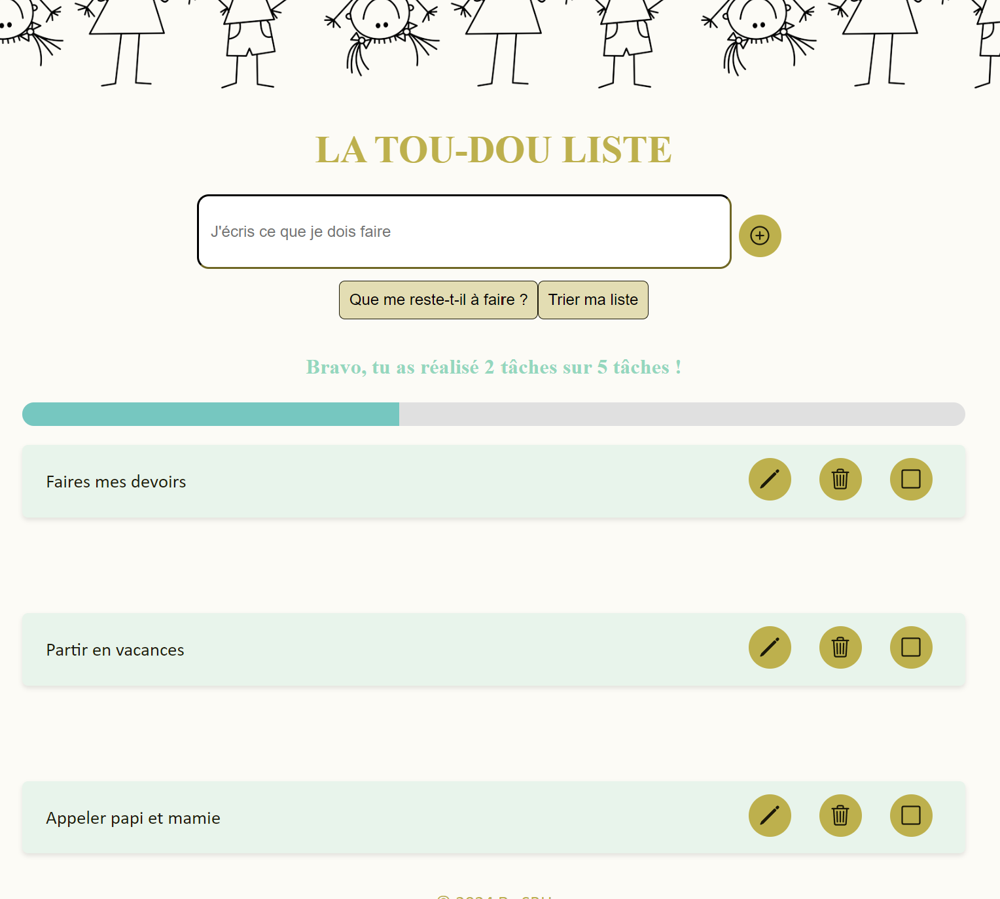
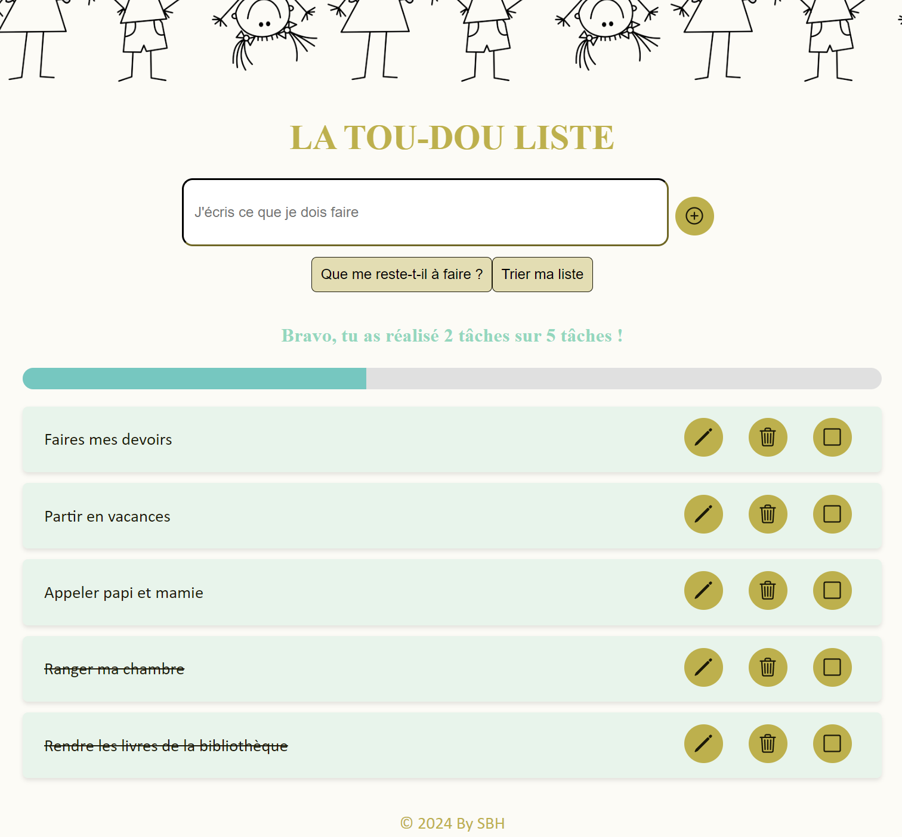

# LA TOU-DOU LISTE

:thumbsup: **Premier projet** pour se lancer dans le développement web.

**Une to-do liste simple** avec les fonctionnalités essentielles.

## A quoi ça sert ?

- [x] enregistrer ta liste de tâches à faire

- [x] modifier les tâches

- [x] supprimer les tâches

- [x] cocher les tâches réalisées

- [x] filtrer celles qu'il te reste à faire

- [x] trier la liste pour remonter les tâches qu'il te reste

et

- [x] **garder un oeil sur ta progression** et savoir combien de tâches tu as réalisé

## A quoi ça ressemble ?

## Avec quels outils ?

- Javascript

#### Et avec l'aide de :

- [La Minute De Code](https://github.com/laminutedecode) et ses précieux [fichiers et tutoriel video](https://github.com/laminutedecode/Todo-List-Youtube). Merci ! :raised_hands:

- Notre ami ChatGPT

## La suite ?

- [ ]
  Corriger les erreurs dans le code
- [ ]
  Améliorer le design

## Une contribution ?

Les commentaires constructifs sont les bienvenus. :ok_hand:
